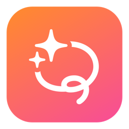

<p align="center">
  
</p>

# Lasso

**Circle to Search, for your Mac.** Press **⌃⌥X**, draw a glowing lasso around
anything on your screen, and AI tells you what it is, where it's from, and what
to do next.

## Install

```bash
brew install yannickpulver/tap/lasso
```

Then: open Lasso, click the menu bar icon → **Settings…**, paste a Gemini API key
(free at [aistudio.google.com](https://aistudio.google.com/apikey)).

First capture: grant **Screen Recording** permission when prompted
(System Settings → Privacy & Security → Screen & System Audio Recording), then relaunch Lasso.

## Development

```bash
swift run
```

Uses the key from Settings, or `GEMINI_API_KEY` env var as fallback.
When running from a terminal, Screen Recording permission goes to the terminal app.

## Usage

- **⌃⌥X** (or menu bar icon → Lasso & Ask): draw around anything, get an answer
- **Esc** while drawing: cancel
- Result card: text is read instantly on-device while the full answer streams
  in; the card stays pinned on top while searching (clicks pass through), then
  click source chips to open them, 📍 opens the address in Maps,
  **Esc** or clicking into another app dismisses it, drag it anywhere
- Menu bar icon → Quit

## Configuration

- Gemini model & thinking level: `Sources/Lasso/GeminiClient.swift`
  (default `gemini-3.5-flash`; thinking is routed — `low` for text crops,
  `medium` for image identification)
- Instant on-device first read (OCR / barcodes): `Sources/Lasso/VisionRecognizer.swift`
- Hotkey: `Sources/Lasso/HotkeyManager.swift` (`kVK_ANSI_X`, `controlKey | optionKey`)
- Answer style: `Sources/Lasso/AnswerPrompt.swift`
